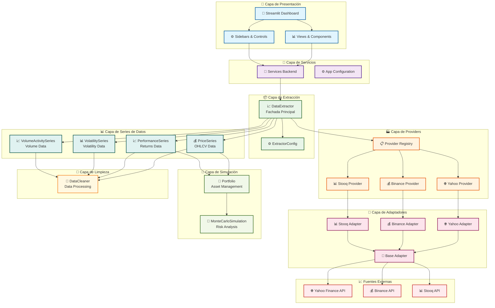
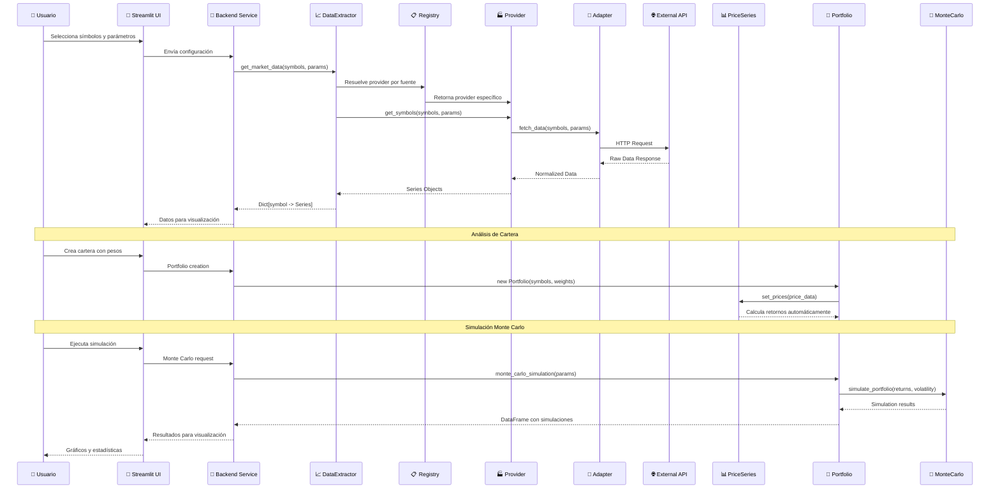

# 🏗️ Arquitectura del Analizador Bursátil

## Diagrama de Arquitectura General

## Flujo de Datos Detallado

## Patrones de Diseño Utilizados

### 1. **Patrón Facade** 
- `DataExtractor` actúa como fachada unificada para todos los providers
- Simplifica la interfaz compleja del sistema de extracción

### 2. **Patrón Registry**
- `REGISTRY` mantiene un mapa de fuentes → providers
- Permite añadir nuevas fuentes dinámicamente

### 3. **Patrón Strategy**
- Cada `Provider` implementa una estrategia diferente de extracción
- `BaseProvider` define la interfaz común

### 4. **Patrón Adapter**
- `BaseAdapter` adapta diferentes APIs externas a una interfaz común
- Cada adapter maneja las peculiaridades de su API específica

### 5. **Patrón Template Method**
- `BaseSeries` define el template para todas las series de datos
- Cada serie implementa sus métodos específicos

## Métricas y Análisis Disponibles

### 📊 **Métricas Básicas**
- Media y desviación estándar (automáticas)
- Retorno esperado y volatilidad
- Ratio de Sharpe

### 🎲 **Simulación Monte Carlo**
- Trayectorias de precios simuladas
- Intervalos de confianza
- Análisis de percentiles
- Visualización interactiva

## Tecnologías y Dependencias

### **Core**
- Python 3.10+
- Pandas 2.0+ (manipulación de datos)
- NumPy 1.24+ (cálculos numéricos)

### **APIs Externas**
- yfinance (Yahoo Finance)
- requests (Binance API)
- pandas_datareader (Stooq)

### **UI y Visualización**
- Streamlit (interfaz web)
- Matplotlib (gráficos)
- Seaborn (visualizaciones avanzadas)

### **Testing y Calidad**
- pytest (testing framework)
- pytest-cov (cobertura de código)
- black, flake8, mypy (calidad de código)
