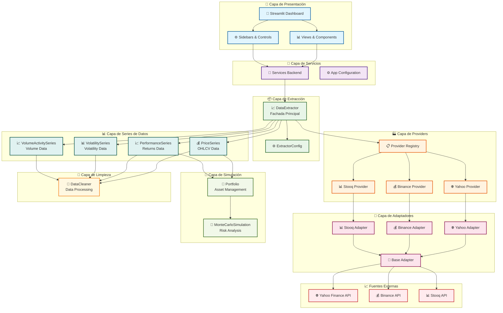
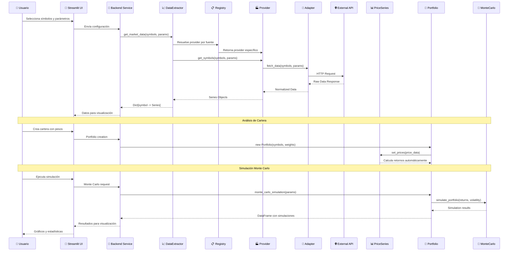
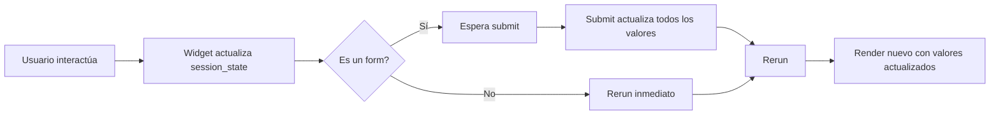

# 🏗️ Arquitectura del Analizador Bursátil

## Diagrama de Arquitectura General



## Flujo de Datos Detallado



## Patrones de Diseño Utilizados

### 1. **Patrón Facade** 
- `DataExtractor` actúa como fachada unificada para todos los providers
- Simplifica la interfaz compleja del sistema de extracción

### 2. **Patrón Registry**
- `REGISTRY` mantiene un mapa de fuentes → providers
- Permite añadir nuevas fuentes dinámicamente

### 3. **Patrón Strategy**
- Cada `Provider` implementa una estrategia diferente de extracción
- `BaseProvider` define la interfaz común

### 4. **Patrón Adapter**
- `BaseAdapter` adapta diferentes APIs externas a una interfaz común
- Cada adapter maneja las peculiaridades de su API específica

### 5. **Patrón Template Method**
- `BaseSeries` define el template para todas las series de datos
- Cada serie implementa sus métodos específicos

## 🎨 Arquitectura de UI (Streamlit)

### Estructura de Archivos

```
src/ui/
├── dashboard.py                 # Punto de entrada principal
├── app_config.py               # Configuración de la app
├── services_backend.py         # Servicios backend
├── error_handler.py            # Manejo de errores
├── file_loader.py              # Carga de archivos
├── utils.py                    # Utilidades compartidas
│
├── views/                      # Vistas principales
│   ├── __init__.py
│   ├── datos_view.py           # Pestaña Datos
│   ├── cartera_view.py         # Pestaña Cartera
│   ├── montecarlo_view.py      # Pestaña Monte Carlo
│   └── reporte_view.py         # Pestaña Reporte
│
└── sidebars/                   # Controles laterales
    ├── __init__.py
    ├── types.py                # Dataclasses para parámetros
    ├── datos_sidebar.py        # Sidebar Datos
    ├── cartera_sidebar.py     # Sidebar Cartera
    ├── montecarlo_sidebar.py  # Sidebar Monte Carlo
    └── reporte_sidebar.py      # Sidebar Reporte
```

### Flujo de Session State



### Componentes Principales

1. **Sidebars** (`sidebars/`)
   - Cada pestaña tiene su propio sidebar
   - Contiene formularios y controles
   - Retorna parámetros validados

2. **Views** (`views/`)
   - Contenido principal de cada pestaña
   - Recibe parámetros del sidebar
   - Muestra visualizaciones y resultados

3. **Utils** (`utils.py`)
   - Funciones compartidas entre views/sidebars
   - Manejo de símbolos
   - Validaciones comunes

### 🔧 Características Actuales

#### Inputs de Símbolos
- ✅ **Panel central**: Inputs en el panel principal para mejor visibilidad
- ✅ **Persistencia**: Los símbolos se mantienen al cambiar de pestaña
- ✅ **Importación entre pestañas**: Fácil copiar símbolos entre Datos y Cartera
- ✅ **Carga de archivos**: Soporte para CSV, Excel, JSON, TXT

#### Sistema de Pesos de Cartera
- ✅ **Validación inteligente**: Tolerancia a redondeos (33%+33%+33%=99%)
- ✅ **Visualización monetaria**: Muestra valores absolutos en dólares
- ✅ **Error cuando excede 100%**: Prevención de pesos inválidos
- ✅ **Normalización automática**: Ajuste proporcional cuando suma < 100%

#### Validación de Datos
- ✅ **Error cuando faltan símbolos**: Prevención de ejecución vacía
- ✅ **Mensajes informativos**: Guía clara para el usuario
- ✅ **Validación de formato**: Verificación de símbolos parseados

#### UI/UX
- ✅ **CSS personalizado**: Sidebar con fondo azul para contraste
- ✅ **Botones mejorados**: Iconos y ancho completo
- ✅ **Monte Carlo integrado**: Valor inicial automático desde cartera

## Métricas y Análisis Disponibles

### 📊 **Métricas Básicas**
- Media y desviación estándar (automáticas)
- Retorno esperado y volatilidad
- Ratio de Sharpe

### 🎲 **Simulación Monte Carlo**
- Trayectorias de precios simuladas
- Intervalos de confianza
- Análisis de percentiles
- Visualización interactiva

## Tecnologías y Dependencias

### **Core**
- Python 3.10+
- Pandas 2.0+ (manipulación de datos)
- NumPy 1.24+ (cálculos numéricos)

### **APIs Externas**
- yfinance (Yahoo Finance)
- requests (Binance API)
- pandas_datareader (Stooq)

### **UI y Visualización**
- Streamlit (interfaz web)
- Matplotlib (gráficos)
- Seaborn (visualizaciones avanzadas)

### **Testing y Calidad**
- pytest (testing framework)
- pytest-cov (cobertura de código)
- black, flake8, mypy (calidad de código)
