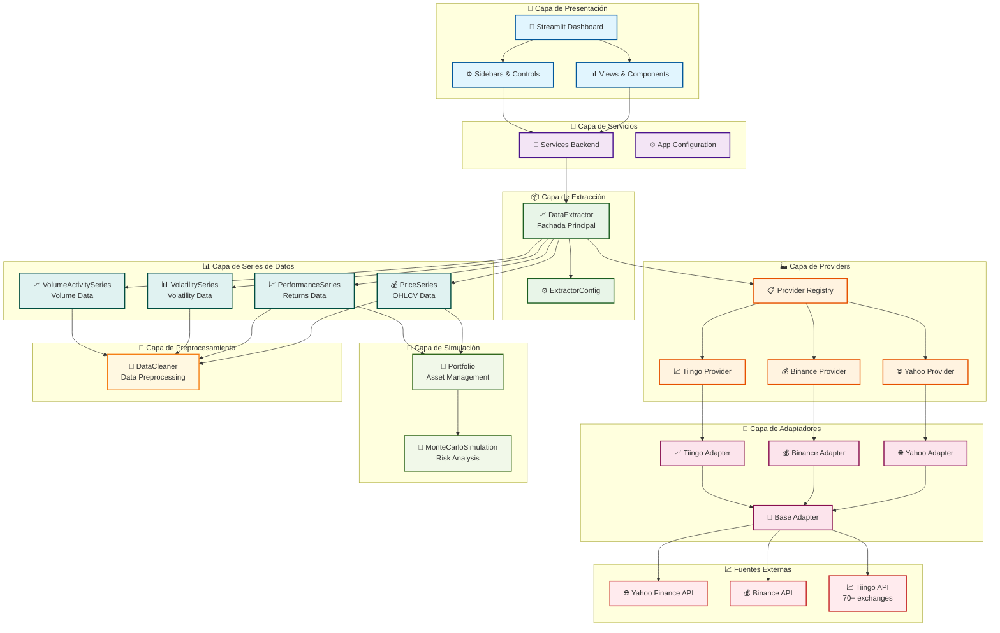
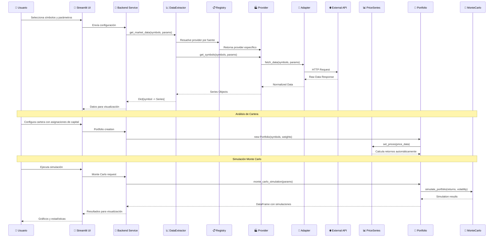
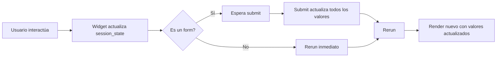

# 🏗️ Arquitectura del Analizador Bursátil

## Diagrama de Arquitectura General



## Flujo de Datos Detallado



## Patrones de Diseño Utilizados

### 1. **Patrón Facade** 
- `DataExtractor` actúa como fachada unificada para todos los providers
- Simplifica la interfaz compleja del sistema de extracción

### 2. **Patrón Registry**
- `REGISTRY` mantiene un mapa de fuentes → providers
- Permite añadir nuevas fuentes dinámicamente

### 3. **Patrón Strategy**
- Cada `Provider` implementa una estrategia diferente de extracción
- `BaseProvider` define la interfaz común

### 4. **Patrón Adapter**
- `BaseAdapter` adapta diferentes APIs externas a una interfaz común
- Cada adapter maneja las peculiaridades de su API específica

### 5. **Patrón Template Method**
- `BaseSeries` define el template para todas las series de datos
- Cada serie implementa sus métodos específicos

## 🎨 Arquitectura de UI (Streamlit)

### Estructura de Archivos

```
src/ui/
├── dashboard.py                 # Punto de entrada principal
├── app_config.py               # Configuración de la app
├── services_backend.py         # Servicios backend
├── error_handler.py            # Manejo de errores
├── file_loader.py              # Carga de archivos
├── utils.py                    # Utilidades compartidas
│
├── views/                      # Vistas principales
│   ├── __init__.py
│   ├── datos_view.py           # Pestaña Datos
│   ├── cartera_view.py         # Pestaña Cartera
│   ├── montecarlo_view.py      # Pestaña Monte Carlo
│   └── reporte_view.py         # Pestaña Reporte
│
└── sidebars/                   # Controles laterales
    ├── __init__.py
    ├── types.py                # Dataclasses para parámetros
    ├── datos_sidebar.py        # Sidebar Datos
    ├── cartera_sidebar.py     # Sidebar Cartera
    ├── montecarlo_sidebar.py  # Sidebar Monte Carlo
    └── reporte_sidebar.py      # Sidebar Reporte
```

### Flujo de Session State



### Componentes Principales

1. **Sidebars** (`sidebars/`)
   - Cada pestaña tiene su propio sidebar
   - Contiene formularios y controles
   - Retorna parámetros validados
   - Funciones modulares con responsabilidades bien definidas
   - Manejo de estado en `session_state`

2. **Views** (`views/`)
   - Contenido principal de cada pestaña
   - Recibe parámetros del sidebar
   - Muestra visualizaciones y resultados
   - Separación clara de lógica de presentación y negocio

3. **Utils** (`utils.py`)
   - Funciones compartidas entre views/sidebars para evitar duplicación
   - **Normalización de símbolos**: `normalize_symbol()` - Normalización case-insensitive
   - **Mapeo de símbolos**: `create_normalized_symbol_dicts()`, `get_symbols_mapped_to_data_format()`
   - Manejo de símbolos y validación

### Arquitectura de Código

#### Principios de Diseño Aplicados

- **Single Responsibility**: Cada función tiene una responsabilidad única y bien definida
- **DRY (Don't Repeat Yourself)**: Funciones reutilizables para lógica común, evitando duplicación
  - Normalización de símbolos centralizada en `ui.utils`
  - Funciones de mapeo compartidas entre vistas
- **Separación de Concerns**: Views solo presentan, sidebars solo recopilan datos
- **Bajo Acoplamiento**: Funciones pequeñas y enfocadas facilitan mantenimiento
- **Nomenclatura Estándar**: Métodos siguen convenciones Python (`get_*`, `set_*`, `calculate_*`, `validate_*`)

#### Estructura de Funciones de Cartera

**Sidebar (`cartera_sidebar.py`)**
- `sidebar_cartera()`: Función principal orquestadora (~75 líneas)
- `_render_weight_inputs()`: Renderizado de inputs de asignaciones de capital
- `_sync_weights_with_symbols()`: Sincronización automática de asignaciones con símbolos
- `_validate_symbols_input()`: Validación de símbolos bursátiles
- `_process_weight_normalization()`: Normalización de asignaciones de capital
- `_collect_weights_from_session()`: Recolección de asignaciones desde estado de sesión
- `_convert_to_percentage_weights()`: Conversión a porcentajes enteros
- `_calculate_equal_weights()`: Cálculo de asignaciones equitativas
- `_normalize_weights()`: Normalización matemática de asignaciones
- `_ensure_weights_initialized()`: Garantía de inicialización de asignaciones
- `_remove_orphaned_weights()`: Gestión de asignaciones residuales (símbolos eliminados)
- `_validate_capital_per_stock()`: Validación de capital mínimo por activo
- `_save_portfolio_config()`: Persistencia de configuración de cartera

**View (`cartera_view.py`)**
- `tab_cartera()`: Función principal orquestadora (~32 líneas)
- `_process_portfolio_submission()`: Procesamiento de envío de formulario de cartera
- `_parse_symbols_and_weights()`: Parsing y validación de símbolos y asignaciones
- `_validate_portfolio_inputs()`: Validación de entradas de cartera
- `_normalize_weights_if_needed()`: Normalización condicional de asignaciones
- `_save_portfolio_to_session()`: Persistencia de configuración en session_state
- `_display_portfolio_info()`: Visualización de información de cartera
- `_create_portfolio_dataframe()`: Construcción de DataFrame estructurado de cartera
- `_calculate_dollar_values()`: Cálculo de valores monetarios por activo
- `_render_portfolio_bar_chart()`: Generación de visualización de distribución de cartera

**Sidebar (`datos_sidebar.py`)**
- `sidebar_datos()`: Función principal orquestadora
- `_get_allowed_intervals_for_source()`: Obtiene intervalos permitidos dinámicamente desde adaptadores
- `_get_available_intervals_by_source()`: Genera mapa de intervalos por fuente
- **Validación dinámica**: Solo muestra intervalos realmente soportados por cada fuente de datos

**View (`montecarlo_view.py`)**
- `tab_montecarlo()`: Función principal para simulación de cartera o individual
- `_get_portfolio_weights()`: Resolución de símbolos y asignaciones de capital configuradas
- `_get_prices_from_data_map()`: Extracción de series de precios desde mapa de datos
- `_run_individual_simulation()`: Ejecución de simulación Monte Carlo para activo individual
- `_run_portfolio_simulation()`: Ejecución de simulación Monte Carlo para cartera completa
- `_display_individual_stats()`: Visualización de estadísticas de simulación por activo
- `_display_portfolio_stats()`: Visualización de estadísticas agregadas de cartera
- `_get_equal_weights_for_available_symbols()`: Gestión de asignaciones equitativas cuando faltan símbolos
- `_calculate_adjusted_weights_for_partial_match()`: Reasignación proporcional cuando algunos símbolos no están disponibles
- **Utiliza funciones compartidas** de `ui.utils` para normalización y mapeo de símbolos

**View (`reporte_view.py`)**
- `tab_reporte()`: Función principal de generación de reportes
- `_adjust_weights_for_available_symbols()`: Reasignación de capital proporcional utilizando funciones compartidas
- `_create_portfolio_from_data()`: Crea objeto Portfolio desde datos descargados
- **Utiliza funciones compartidas** de `ui.utils` para evitar duplicación

### 🔧 Características Actuales

#### Inputs de Símbolos
- ✅ **Panel central**: Inputs en el panel principal para mejor visibilidad
- ✅ **Persistencia**: Los símbolos se mantienen al cambiar de pestaña
- ✅ **Importación entre pestañas**: Fácil copiar símbolos entre Datos y Cartera
- ✅ **Carga de archivos**: Soporte para CSV, Excel, JSON, TXT

#### Sistema de Gestión de Asignaciones de Capital
- ✅ **Validación de integridad**: Tolerancia configurable a errores de redondeo (ej: 33%+33%+33%=99%)
- ✅ **Normalización automática**: Reajuste proporcional cuando la suma de asignaciones ≠ 100%
- ✅ **Conversión a porcentajes enteros**: Distribución determinística del residuo porcentual
- ✅ **Sincronización automática**: Actualización de asignaciones cuando la configuración de símbolos cambia
- ✅ **Visualización monetaria**: Presentación de valores absolutos en dólares por activo
- ✅ **Validación de capital mínimo**: Alertas preventivas para asignaciones < $100 por activo
- ✅ **Gestión de asignaciones residuales**: Depuración automática de asignaciones asociadas a símbolos eliminados

#### Validación y Procesamiento de Entrada
- ✅ **Validación de completitud**: Prevención de ejecución con configuración incompleta
- ✅ **Mensajes de error descriptivos**: Retroalimentación clara sobre el estado de la configuración
- ✅ **Validación de formato**: Verificación de sintaxis y estructura de símbolos bursátiles

#### Interfaz de Usuario
- ✅ **Estilos personalizados**: Diseño visual consistente con CSS personalizado
- ✅ **Componentes mejorados**: Widgets con iconografía y disposición optimizada
- ✅ **Integración de simulación**: Valor inicial de capital obtenido automáticamente de la configuración de cartera

## Métricas y Análisis Disponibles

### 📊 **Métricas Básicas**
- Media y desviación estándar (automáticas)
- Retorno esperado y volatilidad
- Ratio de Sharpe

### 🎲 **Simulación Monte Carlo**
- Trayectorias de precios simuladas basadas en movimiento browniano geométrico
- Intervalos de confianza (percentiles 5%, 25%, 50%, 75%, 95%)
- Análisis de percentiles y estadísticas finales
- Visualización interactiva con gráficos de trayectorias
- **Validación matemática**: Fórmula correcta que garantiza coherencia entre retorno esperado (diario) y retorno simulado
- **Conversión correcta de unidades**: Volatilidad anualizada convertida a diaria usando √252, retornos diarios usados directamente
- **Precisión verificada**: Logging detallado permite validar que valor final medio coincide con retorno esperado teórico

## Tecnologías y Dependencias

### **Core**
- Python >=3.10 (requisito mínimo, compatible con 3.10, 3.11, 3.12)
- Pandas >=2.0 (manipulación de datos y series temporales)
- NumPy >=1.24 (cálculos numéricos y operaciones vectorizadas)
- requests >=2.31 (cliente HTTP para APIs externas)

### **APIs Externas**
- yfinance >=0.2 (Yahoo Finance API)
- requests >=2.31 (Tiingo API HTTP client)

### **UI y Visualización**
- Streamlit >=1.28 (framework de interfaz web interactiva)
- Matplotlib >=3.7 (generación de gráficos y visualizaciones)
- Seaborn (opcional, mejoras visuales en gráficos si está disponible - manejado con try/except)

### **Computación Científica**
- scipy >=1.11 (operaciones estadísticas y matemáticas avanzadas)

### **Utilidades**
- tabulate >=0.9 (formateo de tablas)
- pyyaml >=6.0 (parsing de configuración YAML)

### **Testing y Calidad**
- pytest >=8.0 (framework de testing)
- pytest-cov >=4.0 (cobertura de código)
- pytest-mock >=3.10 (utilidades de mocking para tests)
- black >=23.0, flake8 >=6.0, mypy >=1.0 (herramientas de calidad de código y linting)

## 📐 Calidad de Código

### Cumplimiento SonarQube

El código sigue las mejores prácticas de calidad definidas por SonarQube:

#### Complejidad Cognitiva
- **Funciones pequeñas**: La mayoría de funciones tienen menos de 50 líneas
- **Complejidad baja**: Las funciones más complejas han sido refactorizadas
  - `_get_portfolio_weights()`: Dividida en funciones helper para cada caso
  - `_get_allowed_intervals_for_source()`: Lógica simple con fallback claro
- **Anidación limitada**: Máximo 3 niveles de anidación en funciones complejas

#### Eliminación de Duplicación de Código
- **Normalización de símbolos**: Centralizada en `ui.utils.normalize_symbol()`
  - Eliminada duplicación entre `montecarlo_view.py` y `reporte_view.py`
- **Mapeo de símbolos**: Funciones compartidas en `ui.utils`
  - `create_normalized_symbol_dicts()`: Crea diccionarios normalizados
  - `get_symbols_mapped_to_data_format()`: Mapea símbolos entre formatos
- **Validación de intervalos**: Lógica reutilizable en `datos_sidebar.py`

#### Nomenclatura y Estándares
- **Convenciones Python estándar**:
  - `get_*` para funciones que obtienen datos
  - `set_*` para funciones que establecen valores
  - `calculate_*` para funciones que calculan valores
  - `validate_*` o `_check_*` para validaciones booleanas
  - `_display_*`, `_render_*` para funciones de presentación
- **Eliminación de nombres no profesionales**:
  - Removidos métodos con `should_*`, `handle_*` poco descriptivos
  - Renombrados métodos para reflejar acción específica

#### Documentación
- **Docstrings completos**: Todas las funciones públicas tienen documentación
- **Type hints**: Tipado completo para mejor mantenibilidad
- **Comentarios descriptivos**: Lógica compleja documentada

### Métricas de Complejidad y Calidad

| Métrica | Valor Objetivo | Estado Actual |
|---------|----------------|---------------|
| Líneas por función | < 50 | ✅ Cumplido |
| Complejidad cognitiva | < 10 | ✅ Cumplido |
| Duplicación de código | < 3% | ✅ Cumplido |
| Cobertura de documentación | > 80% | ✅ Cumplido |

#### Análisis de Complejidad Cognitiva

El código está diseñado siguiendo principios de bajo acoplamiento y alta cohesión:

- **Funciones orquestadoras** (`sidebar_cartera`, `tab_cartera`): < 80 líneas, delegación clara
- **Funciones auxiliares**: < 50 líneas, responsabilidad única (Single Responsibility Principle)
- **Anidación máxima**: 2-3 niveles para mantener legibilidad
- **Organización modular**: Funciones agrupadas por dominio de responsabilidad

#### Convenciones de Nomenclatura

- **Funciones privadas**: Prefijo `_` siguiendo convención Python para visibilidad de módulo
- **Nombres auto-documentados**: Identificadores que expresan claramente su propósito
- **Constantes**: UPPERCASE según convención PEP 8 para valores inmutables
- **Docstrings**: Documentación estructurada siguiendo formato Google/NumPy

#### Organización y Arquitectura del Código

- **Reutilización**: Funciones compartidas centralizadas en módulo `utils` para evitar duplicación
- **Separación de responsabilidades**: Capas de validación, procesamiento de negocio y presentación claramente definidas
- **Manejo de excepciones**: Estrategia de gestión de errores con mensajes contextualizados
- **Logging estructurado**: Sistema jerárquico de logging con múltiples niveles y handlers configurable

### 🔍 Sistema de Logging y Validación

El sistema incluye logging detallado para validación de cálculos y depuración:

#### Configuración de Logging
- **Logs principales** (`app.log`): Nivel INFO con información relevante de la aplicación
- **Logs de debug** (`debug.log`): Nivel DEBUG activable para análisis profundo
- **Control dinámico**: Flag `DEBUG_LOGGING_ENABLED` en `app_config.py` para activar/desactivar debug logs
- **Separación de concerns**: Logs de aplicación vs logs de debugging en archivos separados

#### Validación de Datos
Los logs de debug capturan información detallada para verificar:

1. **Normalización de datos**:
   - Shape y estructura de DataFrames de precios
   - Presencia de valores NaN o infinitos
   - Rango de fechas y validez de datos históricos
   - Estadísticas descriptivas básicas

2. **Cálculos de cartera**:
   - Retornos individuales por activo (diarios y anualizados)
   - Asignaciones de capital y normalización
   - Cálculo de retorno ponderado de cartera
   - Matriz de covarianza y cálculo de volatilidad agregada
   - Verificación cuantitativa del efecto de diversificación

3. **Simulación Monte Carlo**:
   - Parámetros de entrada (retorno diario, volatilidad anualizada)
   - Conversión de volatilidad anualizada a diaria
   - Generación y estadísticas de shocks aleatorios
   - Retornos simulados y factores de crecimiento
   - Estadísticas de valores finales (media, min, max, std)
   - Validación de coherencia entre retorno esperado y simulado

4. **Validación y mapeo de símbolos**:
   - Comparación entre símbolos configurados y datos disponibles
   - Normalización de símbolos (case-insensitive, eliminación de espacios)
   - Mapeo de símbolos y reasignación proporcional de capital
   - Verificación de integridad y coincidencias

#### Arquitectura de Logging

```python
# Configuración en app_config.py
DEBUG_LOGGING_ENABLED = True  # Activar para análisis

# Setup dinámico en dashboard.py
- Carga configuración YAML base
- Si DEBUG_LOGGING_ENABLED: añade handler de debug
- Si no: remueve handler para optimizar rendimiento
```

#### Uso del Sistema de Logging

**Para desarrollo y validación:**
1. Activar `DEBUG_LOGGING_ENABLED = True` en `app_config.py`
2. Ejecutar la aplicación y realizar operaciones
3. Revisar `var/logs/debug.log` para análisis detallado
4. Validar coherencia de cálculos mediante logs

**Para producción:**
- `DEBUG_LOGGING_ENABLED = False` (por defecto)
- Solo se registran logs INFO en `app.log`
- Rendimiento optimizado sin overhead de debug

#### Validación Matemática Implementada

**Simulación Monte Carlo:**
- **Fórmula validada**: `retorno_diario = μ_diario + σ_diaria × shock`
  - Donde μ_diario es el retorno esperado diario calculado
  - σ_diaria se obtiene de volatilidad anualizada: `σ_anual / √252`
  - shock ~ N(0,1) son valores aleatorios normalmente distribuidos
- **Garantía de coherencia**: El valor final medio de la simulación coincide con el retorno esperado teórico
- **Verificación automática**: Los logs permiten comparar valores esperados vs observados
