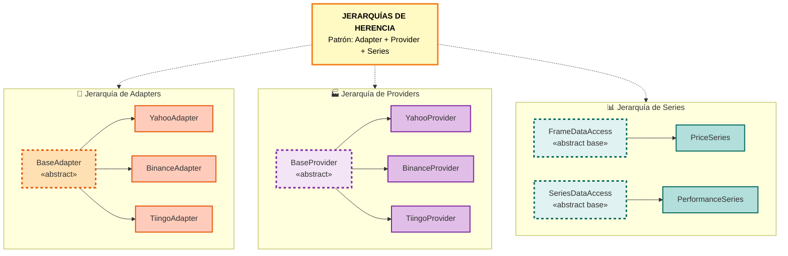

# 📊 Diagramas de Arquitectura del Proyecto

Este documento contiene los diagramas visuales de la arquitectura del **Analizador Bursátil**.

---

## 🌳 1. Jerarquías de Herencia

Muestra las tres jerarquías de clases principales del proyecto, destacando el uso de **clases abstractas** y **patrones de diseño**.

---

## ➡️ 2. Flujo de Arquitectura y Procesamiento

Muestra el flujo completo de datos desde la solicitud del usuario hasta los resultados finales.

```mermaid
graph LR
    %% ============================================
    %% DIAGRAMA 2: FLUJO Y ARQUITECTURA
    %% Horizontal - Muestra el flujo de datos
    %% ============================================
    
    UI[📱<br/>Streamlit<br/>Dashboard]
    
    FACADE[🎯<br/>DataExtractor<br/><i>Facade</i>]
    
    subgraph SOURCES["🏭 Fuentes de Datos"]
        direction TB
        PROV[Providers<br/>Yahoo · Binance · Tiingo]
        ADAP[Adapters<br/>Yahoo · Binance · Tiingo]
        PROV --> ADAP
    end
    
    APIS[🌐<br/>APIs<br/>Externas]
    
    NORM[⚙️<br/>Normalizer<br/>OHLCV]
    
    SERIES[📊<br/>Series<br/>de Datos]

    CLEANER[🧽<br/>DataCleaner]

    PORTFOLIO[💼<br/>Portfolio<br/>Log-returns]

    MC[🎲<br/>Monte Carlo<br/>GBM + Itô]

    REPORTS[📄<br/>Report Generator]

    RESULTS[📈<br/>Resultados]
    
    %% FLUJO PRINCIPAL
    UI -->|1. Request| FACADE
    FACADE -->|2. Delega| SOURCES
    SOURCES -->|3. HTTP| APIS
    APIS -->|4. JSON| SOURCES
    SOURCES -->|5. Datos| NORM
    NORM -->|6. Crea| SERIES
    SERIES -->|7. Limpia| CLEANER
    CLEANER -->|8. Alimenta| PORTFOLIO
    PORTFOLIO -->|9. Simula| MC
    MC -->|10. Reporta| REPORTS
    REPORTS -->|11. Output| RESULTS
    RESULTS --> UI
    
    %% ESTILOS
    style UI fill:#e3f2fd,stroke:#1976d2,stroke-width:3px
    style FACADE fill:#fff3e0,stroke:#f57c00,stroke-width:3px
    style PROV fill:#f3e5f5,stroke:#7b1fa2,stroke-width:2px
    style ADAP fill:#ffe0b2,stroke:#e65100,stroke-width:2px
    style APIS fill:#ffebee,stroke:#c62828,stroke-width:2px
    style NORM fill:#e8f5e9,stroke:#388e3c,stroke-width:2px
    style SERIES fill:#e0f2f1,stroke:#00695c,stroke-width:2px
    style CLEANER fill:#fff8e1,stroke:#f57f17,stroke-width:2px
    style PORTFOLIO fill:#f1f8e9,stroke:#689f38,stroke-width:3px
    style MC fill:#c5e1a5,stroke:#689f38,stroke-width:3px
    style REPORTS fill:#ede7f6,stroke:#4527a0,stroke-width:2px
    style RESULTS fill:#e3f2fd,stroke:#1976d2,stroke-width:2px
```

