# 📊 Diagramas de Arquitectura del Proyecto

Este documento contiene los diagramas visuales de la arquitectura del **Analizador Bursátil**.

---

## 🌳 1. Jerarquías de Herencia

Muestra las tres jerarquías de clases principales del proyecto, destacando el uso de **clases abstractas** y **patrones de diseño**.

```mermaid
graph TB
    %% ============================================
    %% DIAGRAMA 1: JERARQUÍAS DE HERENCIA
    %% Muestra solo las herencias de forma clara
    %% ============================================
    
    TITLE["<b>JERARQUÍAS DE HERENCIA</b><br/>Patrón: Adapter + Provider + Series"]
    
    subgraph HIER1["🔌 Jerarquía de Adapters"]
        BA["BaseAdapter<br/>«abstract»<br/><br/>+download_symbol&#40;&#41;<br/>+get_symbols&#40;&#41;"]
        
        YA[YahooAdapter]
        BIA[BinanceAdapter]
        TIA[TiingoAdapter]
        
        BA --> YA
        BA --> BIA
        BA --> TIA
    end
    
    subgraph HIER2["🏭 Jerarquía de Providers"]
        BP["BaseProvider<br/>«abstract»<br/><br/>+get_symbols&#40;&#41;<br/>+get_data&#40;&#41;"]
        
        YP[YahooProvider]
        BIP[BinanceProvider]
        TIP[TiingoProvider]
        
        BP --> YP
        BP --> BIP
        BP --> TIP
    end
    
    subgraph HIER3["📊 Jerarquía de Series"]
        BS["BaseSeries<br/>«abstract»<br/><br/>+symbol<br/>+data<br/>+to_dataframe&#40;&#41;"]
        
        PS[PriceSeries]
        PERF[PerformanceSeries]
        VOL[VolatilitySeries]
        
        BS --> PS
        BS --> PERF
        BS --> VOL
    end
    
    TITLE -.-> HIER1 & HIER2 & HIER3
    
    %% ESTILOS
    style TITLE fill:#fff9c4,stroke:#f57f17,stroke-width:3px,color:#000
    
    %% Clases abstractas
    style BA fill:#ffe0b2,stroke:#e65100,stroke-width:3px,stroke-dasharray: 5 5
    style BP fill:#f3e5f5,stroke:#7b1fa2,stroke-width:3px,stroke-dasharray: 5 5
    style BS fill:#e0f2f1,stroke:#00695c,stroke-width:3px,stroke-dasharray: 5 5
    
    %% Adapters concretos
    style YA fill:#ffccbc,stroke:#e65100,stroke-width:2px
    style BIA fill:#ffccbc,stroke:#e65100,stroke-width:2px
    style TIA fill:#ffccbc,stroke:#e65100,stroke-width:2px
    
    %% Providers concretos
    style YP fill:#e1bee7,stroke:#7b1fa2,stroke-width:2px
    style BIP fill:#e1bee7,stroke:#7b1fa2,stroke-width:2px
    style TIP fill:#e1bee7,stroke:#7b1fa2,stroke-width:2px
    
    %% Series concretas
    style PS fill:#b2dfdb,stroke:#00695c,stroke-width:2px
    style PERF fill:#b2dfdb,stroke:#00695c,stroke-width:2px
    style VOL fill:#b2dfdb,stroke:#00695c,stroke-width:2px
```

### 📝 Explicación:

**Patrón Adapter:**
- `BaseAdapter` → Define interfaz común para acceder a diferentes APIs
- Implementaciones: `YahooAdapter`, `BinanceAdapter`, `TiingoAdapter`

**Patrón Provider:**
- `BaseProvider` → Encapsula lógica de orquestación y normalización
- Implementaciones: `YahooProvider`, `BinanceProvider`, `TiingoProvider`

**Jerarquía de Series:**
- `BaseSeries` → Clase base para diferentes tipos de series temporales
- Implementaciones: `PriceSeries` (OHLCV), `PerformanceSeries` (retornos), `VolatilitySeries`

---

## ➡️ 2. Flujo de Arquitectura y Procesamiento

Muestra el flujo completo de datos desde la solicitud del usuario hasta los resultados finales.

```mermaid
graph LR
    %% ============================================
    %% DIAGRAMA 2: FLUJO Y ARQUITECTURA
    %% Horizontal - Muestra el flujo de datos
    %% ============================================
    
    UI[📱<br/>Streamlit<br/>Dashboard]
    
    FACADE[🎯<br/>DataExtractor<br/><i>Facade</i>]
    
    subgraph SOURCES["🏭 Fuentes de Datos"]
        direction TB
        PROV[Providers<br/>Yahoo · Binance · Tiingo]
        ADAP[Adapters<br/>Yahoo · Binance · Tiingo]
        PROV --> ADAP
    end
    
    APIS[🌐<br/>APIs<br/>Externas]
    
    NORM[⚙️<br/>Normalizer<br/>OHLCV]
    
    SERIES[📊<br/>Series<br/>de Datos]
    
    PORTFOLIO[💼<br/>Portfolio<br/>Log-returns]
    
    MC[🎲<br/>Monte Carlo<br/>GBM + Itô]
    
    RESULTS[📈<br/>Resultados]
    
    %% FLUJO PRINCIPAL
    UI -->|1. Request| FACADE
    FACADE -->|2. Delega| SOURCES
    SOURCES -->|3. HTTP| APIS
    APIS -->|4. JSON| SOURCES
    SOURCES -->|5. Datos| NORM
    NORM -->|6. Crea| SERIES
    SERIES -->|7. Alimenta| PORTFOLIO
    PORTFOLIO -->|8. Simula| MC
    MC -->|9. Output| RESULTS
    RESULTS --> UI
    
    %% ESTILOS
    style UI fill:#e3f2fd,stroke:#1976d2,stroke-width:3px
    style FACADE fill:#fff3e0,stroke:#f57c00,stroke-width:3px
    style PROV fill:#f3e5f5,stroke:#7b1fa2,stroke-width:2px
    style ADAP fill:#ffe0b2,stroke:#e65100,stroke-width:2px
    style APIS fill:#ffebee,stroke:#c62828,stroke-width:2px
    style NORM fill:#e8f5e9,stroke:#388e3c,stroke-width:2px
    style SERIES fill:#e0f2f1,stroke:#00695c,stroke-width:2px
    style PORTFOLIO fill:#f1f8e9,stroke:#689f38,stroke-width:3px
    style MC fill:#c5e1a5,stroke:#689f38,stroke-width:3px
    style RESULTS fill:#e3f2fd,stroke:#1976d2,stroke-width:2px
```

### 📝 Explicación del Flujo:

1. **UI (Streamlit):** Usuario interactúa con la aplicación
2. **DataExtractor (Facade):** Punto de entrada único que simplifica la complejidad
3. **Providers + Adapters:** Cada fuente tiene su Provider (orquestación) y Adapter (API específica)
4. **APIs Externas:** Yahoo Finance, Binance, Tiingo
5. **Normalizer:** Unifica los diferentes formatos a estructura estándar OHLCV
6. **Series de Datos:** Crea objetos tipados (PriceSeries, PerformanceSeries, VolatilitySeries)
7. **Portfolio:** Calcula retornos logarítmicos y métricas de riesgo
8. **Monte Carlo:** Simulación con modelo GBM y corrección de Itô
9. **Resultados:** Vuelta a la UI para visualización

---

## 🔗 Archivos Fuente

Los archivos fuente Mermaid están en:
- `docs/diagrams/1_jerarquias_herencia.mmd`
- `docs/diagrams/2_flujo_arquitectura.mmd`

## 📸 Exportar a Imágenes

Para exportar estos diagramas a PNG:

1. Ve a https://mermaid.live/
2. Copia el contenido de cada archivo `.mmd`
3. Pégalo en el editor
4. Click en "Actions" → "PNG"
5. Guarda como:
   - `1_jerarquias_herencia.png`
   - `2_flujo_arquitectura.png`

---

## 📚 Referencias

- [Mermaid Documentation](https://mermaid.js.org/)
- [ARCHITECTURE.md](../ARCHITECTURE.md) - Documentación técnica completa
- [README.md](../../README.md) - Documentación general del proyecto
